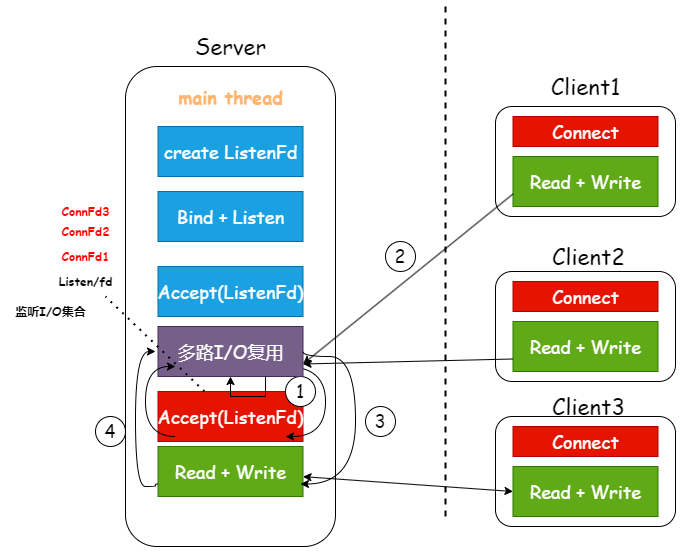

@[toc]
# 一、前言
这一节就是IO复用的入门没有加入多线程。简单来说就是`select`、`poll`、`epoll`的使用。
这些函数相当于是一个代理者，帮助我们处理新连接，可以让CPU空出来。

本章所有代码均可在这个仓库找到，如有帮助留个star吧！[WebServer](https://github.com/AidenYuanDev/TinyWebServer)

# 二、Select
这个是唯一跨平台的，但是性能差很多，一般高性能服务器都用`epoll`

## 1、头文件

-  **<sys/select.h>** 这是主要的头文件，定义了 select 函数及相关的数- 	据类型和宏。
- 	**<sys/time.h>** 定义了 struct timeval，用于 select 的超时参数。
- 	**<sys/types.h>** 定义了一些基本的系统数据类型。
- 	**<unistd.h>** 提供了 POSIX 操作系统 API 的访问，包括 read 和 write 函数。

## 2、select api 参数解析
~~~c
int select(int nfds, fd_set *readfds, fd_set *writefds, fd_set *exceptfds, struct timeval *timeout);
~~~

- **nfds** 这是要监视的文件描述符的最大值加1。（可以设置为1024）
- **readfds** 用于检查哪些文件描述符已准备好读取。
- **writefds** 用于检查哪些文件描述符已准备好写入。（默认填NULL）
- **exceptfds** 用于检查哪些文件描述符有异常条件。（默认填NULL）
- **timeout** 用于设置select的超时时间。

> select 一般只处理读事件就可以了，其他的设置为空。

## 3、示例
~~~c
#include <arpa/inet.h>
#include <netinet/in.h>
#include <sys/select.h>
#include <sys/socket.h>
#include <unistd.h>

#include <algorithm>
#include <iostream>
#include <vector>
using namespace std;
#define BUFFER_SIZE 1024
#define PORT 8080
#define MAX_CLIENTS 30

int main() {
    int server_fd = socket(AF_INET, SOCK_STREAM | SOCK_NONBLOCK, 0);
    if (server_fd < 0) {
        cerr << "socket failed" << endl;
        return 0;
    }

    sockaddr_in server_addr;
    server_addr.sin_family = AF_INET;
    server_addr.sin_addr.s_addr = INADDR_ANY;
    server_addr.sin_port = htons(PORT);

    if (bind(server_fd, (sockaddr *)&server_addr, sizeof server_addr) < 0) {
        cerr << "bind failed" << endl;
        close(server_fd);
        return 0;
    }

    if (listen(server_fd, 3) < 0) {
        cerr << "listen failed" << endl;
        close(server_fd);
    }

    fd_set fds_read;
    vector<int> clients;
    while (1) {
        // 清空fd集合
        FD_ZERO(&fds_read);
        ;

        // 添加服务端socket到fd集合
        FD_SET(server_fd, &fds_read);
        int sd_max = server_fd + 1;

        // 添加客户端socket到fd集合
        for (int client_fd : clients) {
            FD_SET(client_fd, &fds_read);
            sd_max = max(sd_max, client_fd + 1);
        }

        // 监听 select 监听多个套接字
        int activity = select(sd_max, &fds_read, nullptr, nullptr, nullptr);
        if (activity < 0) {
            cerr << "select error" << endl;
            return 0;
        }

        // 是否是新连接
        if (FD_ISSET(server_fd, &fds_read)) {
            int client_fd = accept4(server_fd, nullptr, nullptr, SOCK_NONBLOCK);
            if (client_fd < 0) {
                cerr << "accept4 failed" << endl;
                return 0;
            }
            clients.emplace_back(client_fd);
            cout << "New connection, socket fd is " << client_fd << endl;
        }

        // 处理客户端发来的消息
        for (auto it = clients.begin(); it != clients.end();) {
            int client_fd = *it;
            bool should_remove = false;

            if (FD_ISSET(client_fd, &fds_read)) {
                string buffer(BUFFER_SIZE, 0);
                int read_len = read(client_fd, buffer.data(), BUFFER_SIZE);
                if (read_len < 0) {
                    if (!(errno == EAGAIN || errno == EWOULDBLOCK)) {
                        cerr << "Read error: " << endl;
                        should_remove = true;
                    }
                } else if (read_len == 0) {
                    // 连接断开
                    cout << "Connection closed" << endl;
                    should_remove = true;
                } else {
                    cout << "Received:" << buffer.substr(0, read_len) << endl;
                    // 回显收到的消息
                    string message = "Echo:" + buffer.substr(0, read_len);
                    write(client_fd, message.data(), message.size());
                }
            }
            if (should_remove) {
                close(client_fd);
                it = clients.erase(it);
            } else ++it;
        }
    }
    close(server_fd);
    return 0;
}
~~~

# 三、Poll
`poll`比`select`性能好一点，但是比`epoll`弱，而且都只能在`Linux`下使用,所以实际开发中根本用不到，直接学`epoll`吧。

# 四、Epoll
对于`epoll`的学习，首先第一关肯定是弄明白什么是水平触发，什么是边缘触发了

## 1、触发方式
1. **水平触发 (Level Triggered, LT)**
	- 这是epoll的默认工作模式。
	- 如果用户程序没有一次性将fd上的数据全部读完，那么下次调用epoll_wait时，它还会通知这个fd。
	- **优点**
		- 编程更简单，不容易遗漏事件。
	- **缺点**
		 - 可能会导致频繁的系统调用，效率相对较低。
2. **边缘触发 (Edge Triggered, ET)**
	- 如果用户程序没有一次性将fd上的数据全部读完，epoll不会再次通知。
	- 通常需要用非阻塞I/O，并要注意循环读取直到出现EAGAIN错误。
	- **优点**
		- 系统调用次数少，效率高。
	- **缺点**
		- 编程较复杂，如果处理不当可能会导致事件丢失。

## 2、头文件
- **<sys/epoll.h>** 主要的epoll头文件
- **<unistd.h>**  用于close()
- **<fcntl.h>**  用于fcntl()，设置非阻塞模式
- **<errno.h>** 用于errno变量，错误处理

## 3、api 解释

## 3.1 epoll_create()
创建epoll实例
~~~c
int epoll_create1(int size);
~~~
- 参数
	- size >0
- 返回值
	- 成功时返回新的 epoll 文件描述符。
	- 失败时返回 -1，并设置 errno。

## 3.2 epoll_create1()
创建epoll实例
~~~c
int epoll_create1(int flags);
~~~
- **参数**
	- **flags**
		- **0** 等同于epoll_create()
		- **!0**  EPOLL_CLOEXEC
- **返回值**
	- 成功时返回新的 epoll 文件描述符。
	- 失败时返回 -1，并设置 errno。

## 3.3 epoll_ctl()
控制 epoll 实例，添加、修改或删除监视的文件描述符。
~~~c
int epoll_wait(int epfd, struct epoll_event *events, int maxevents, int timeout);
~~~
参数
- **epfd:** epoll 实例的文件描述符。
- op: 操作类型
	- **EPOLL_CTL_ADD:** 这个操作用于向 epoll 实例添加一个新的文件描述符。
	- **EPOLL_CTL_MOD:** 这个操作用于修改已经添加到 epoll 实例中的文件描述符的事件设置。
	- **EPOLL_CTL_DEL:** 这个操作用于从 epoll 实例中删除一个文件描述符。
- **fd:** 要操作的文件描述符。
- **event:** 指向 epoll_event 结构的指针，描述要监视的事件。
	- **参数**
		- **events** 
			- EPOLLIN 
				- 可读
			- EPOLLOUT 
				- 可写
			- EPOLLLT 
				- 水平触发模式（默认） 
				- 只要文件描述符就绪，每次调用 epoll_wait 都会通知
			- EPOLLET
				- 边缘触发模式
				- 仅在状态变化时通知一次
			- EPOLLONESHOT 
				- 边缘触发模式
		- **data**
			- **sockfd** socket文件描述符
- **返回值:**
	- 成功时返回 0。
	- 失败时返回 -1，并设置 errno。

## 3.4 epoll_wait()
等待 epoll 实例上的事件。
~~~c
int epoll_wait(int epfd, struct epoll_event *events, int maxevents, int timeout);
~~~
- **参数**
	- **epfd:** epoll 实例的文件描述符。
	- **events:** 用于返回触发的事件的数组。
	- **maxevents:** events 数组的大小。
	- **timeout:** 超时时间（毫秒），-1 表示无限等待。
- **返回值**
	- 成功时返回就绪的文件描述符数量。
	- 超时时返回 0。
	- 失败时返回 -1，并设置 errno。

## 3.5 实现

~~~c
#include <errno.h>
#include <fcntl.h>
#include <netinet/in.h>
#include <sys/epoll.h>
#include <sys/socket.h>
#include <unistd.h>

#include <iostream>
#include <queue>
#include <unordered_map>
#include <vector>
using namespace std;
const int PORT = 8080;
const int MAX_EVENTS = 10;
const int BUFFER_SIZE = 1024;

struct Client_Context {
    queue<string> send_queue;
    bool write_ready = false;
};

void handle_error(int client_fd, int epoll_fd, unordered_map<int, Client_Context> &clients) {
    cerr << "Error on socket" << endl;
    close(client_fd);
    epoll_ctl(epoll_fd, EPOLL_CTL_DEL, client_fd, nullptr);
    clients.erase(client_fd);
}

void handle_read(int client_fd, int epoll_fd, unordered_map<int, Client_Context> &clients) {
    string buffer(BUFFER_SIZE, 0);
    while (true) {
        int read_len = read(client_fd, buffer.data(), buffer.size());
        if (read_len < 0) {
            if (errno == EAGAIN || errno == EWOULDBLOCK) break;
            else {
                cerr << "read failed" << endl;
                handle_error(client_fd, epoll_fd, clients);
                break;
            }
        } else if (read_len == 0) {
            // 客户端断开连接
            handle_error(client_fd, epoll_fd, clients);
            break;
        } else {
            cout << "Received:" << buffer.substr(0, read_len) << endl;

            // 回显收到的消息
            string message = "Echo:" + buffer.substr(0, read_len);
            clients[client_fd].send_queue.push(message);
            clients[client_fd].write_ready = true;
        }
    }
}

void handle_write(int client_fd, Client_Context &client) {
    // 只有在写就绪时才执行写操作
    if (!client.write_ready) return;
    while (!client.send_queue.empty()) {
        string &message = client.send_queue.front();
        int write_len = write(client_fd, message.data(), message.size());
        if (write_len < 0) {
            // 写缓冲区已满，等待下一次 EPOLLOUT事件
            if (errno == EAGAIN || errno == EWOULDBLOCK) return;
            else {
                cerr << "Write error" << endl;
                return;
            }
        } else client.send_queue.pop();
    }

    // 所有数据写入完成，重置写就绪标志
    client.write_ready = false;
}

int main() {
    int server_fd = socket(AF_INET, SOCK_STREAM | SOCK_NONBLOCK, 0);
    if (server_fd < 0) {
        cerr << "Socket creation failed" << endl;
        return 0;
    }

    sockaddr_in server_addr;
    server_addr.sin_family = AF_INET;
    server_addr.sin_addr.s_addr = INADDR_ANY;
    server_addr.sin_port = htons(PORT);

    if (bind(server_fd, (sockaddr *)&server_addr, sizeof(server_addr)) < 0) {
        cerr << "Bind failed" << endl;
        close(server_fd);
    }

    if (listen(server_fd, 5) < 0) {
        cerr << "Listen failed" << endl;
        close(server_fd);
        return 0;
    }

    int epoll_fd = epoll_create1(0);
    if (epoll_fd < 0) {
        cerr << "epoll_create1 failed" << endl;
        close(server_fd);
        return 0;
    }

    epoll_event event;
    event.data.fd = server_fd;
    event.events = EPOLLIN | EPOLLET;
    if (epoll_ctl(epoll_fd, EPOLL_CTL_ADD, server_fd, &event) < 0) {
        cerr << "epoll_ctl failed" << endl;
        close(server_fd);
        close(epoll_fd);
        return 0;
    }

    vector<epoll_event> events(MAX_EVENTS);
    unordered_map<int, Client_Context> clients;

    while (true) {
        int event_count = epoll_wait(epoll_fd, events.data(), MAX_EVENTS, -1);
        if (event_count < 0) {
            perror("epoll_wait failed");
            break;
        }

        for (int i = 0; i < event_count; i++) {
            // 处理新连接
            if (events[i].data.fd == server_fd) {
                while (true) {
                    sockaddr_in client_addr;
                    socklen_t client_len = sizeof client_addr;
                    int client_fd = accept4(server_fd, (sockaddr *)&client_addr, &client_len, SOCK_NONBLOCK);
                    if (client_fd < 0) {
                        // 所用连接处理完毕
                        if (errno == EAGAIN || errno == EWOULDBLOCK) break;
                        else {
                            cerr << "Accept failed" << endl;
                            break;
                        }
                    }
                    event.data.fd = client_fd;
                    event.events = EPOLLIN | EPOLLOUT | EPOLLET;
                    if (epoll_ctl(epoll_fd, EPOLL_CTL_ADD, client_fd, &event) < 0) {
                        cerr << "epoll_ctl failed" << endl;
                        close(client_fd);
                    } else clients[client_fd] = Client_Context();
                }
            } else {
                int client_fd = events[i].data.fd;
                if (events[i].events & (EPOLLERR | EPOLLHUP))
                    handle_error(client_fd, epoll_fd, clients);
                else {
                    if (events[i].events & EPOLLIN) handle_read(client_fd, epoll_fd, clients);
                    if (events[i].events & EPOLLOUT) handle_write(client_fd, clients[client_fd]);
                }
            }
        }
    }

    close(server_fd);
    close(epoll_fd);
    return 0;
}
~~~
