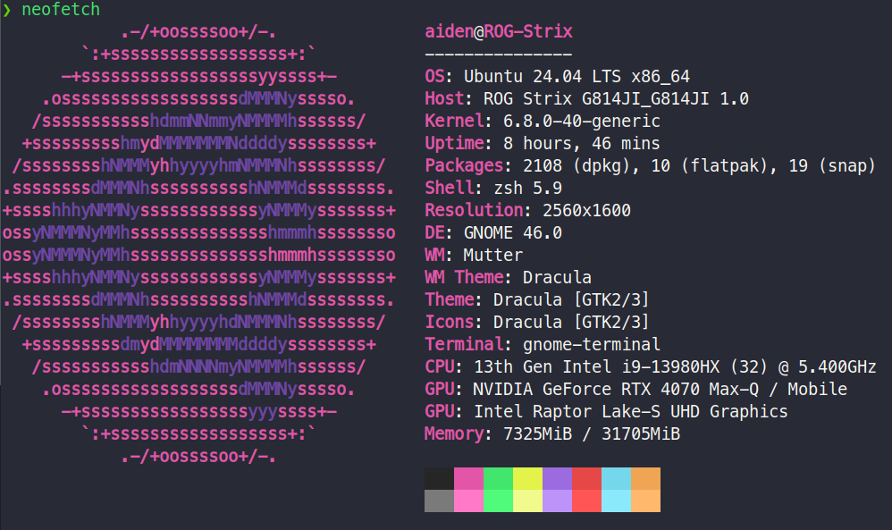
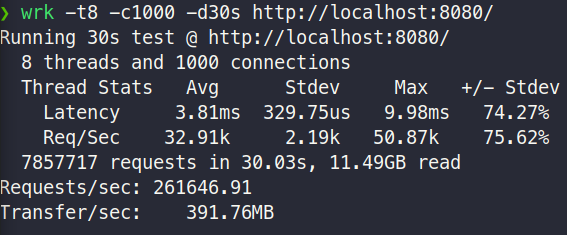

# 一、简介

## IO复用并发模型

从基础socket到高性能epoll的实现

## WebServer

项目使用CMake构建，进行模块化设计。要求编译器支持C++20以上。

使用C++实现的高性能服务器，经过本地测试可实现1000并发26万以上QPS

## 环境要求

- Linux
- C++20
- CMake
- yaml-cpp

# 二、功能

## 已开发部分

- 配置模块：使用库yaml-cpp
- 日志模块：单例模式同步日志模块
- 线程池模块：提供了一个高效、线程安全的线程池，支持异步任务提交和结果获取，具备优雅关闭和等待所有任务完成的能力
- server模块：参考Nginx网络部分和网络库TRANTOR的实现，就是主epoll(边缘触发) + 读写交给线程池的线程
- 消息队列模块：存储的是解析过后客户端fd的请求的响应
- HTTP等相关模块：参考MVC架构，通过HTTP解析器（状态机实现）解析成请求（请求模块），最后通过路由模块，路由管理模块，调用控制器，生成响应报文。

## 未来方向

- orm 数据库中间模块
- 编写触发器(目前只有静态触发器)

# 三、性能测试

## 1 本地测试

### 1.1 本地机器配置

### 1.2测试结果(线程池大小16) —— 1000并发，26万QPS

## 2 服务器测试

### 2.1 服务器配置

2核2G

### 2.2测试结果(线程池大小16) —— 47并发 293QPS

# 四、 作者解析

> 快马加鞭创作中

[常用I/O复用模型 一、单线程Accept(无IO复用)](https://blog.csdn.net/Ten_years_star/article/details/140395553)

[常用I/O复用模型 二、单线程Accept+多线程读写业务(无I/O复用)](https://blog.csdn.net/Ten_years_star/article/details/140412994)

[三、单线程多路I/O复用 —— 常用I/O复用](https://blog.csdn.net/Ten_years_star/article/details/140445242)

[任务调度与执行的C++线程池](https://blog.csdn.net/Ten_years_star/article/details/140526499)

[现代CMake使用，使C++代码解耦](https://blog.csdn.net/Ten_years_star/article/details/140657310)

[四、单线程多路IO复用+多线程业务工作池](https://blog.csdn.net/Ten_years_star/article/details/140666040)

[五、HTTP解析与响应](https://blog.csdn.net/Ten_years_star/article/details/140848143)
